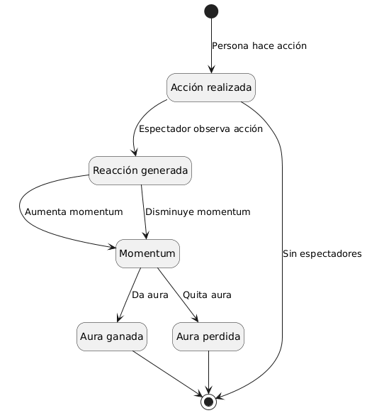

# Reto 001 - Modelo del Dominio: Farmear Aura

- **Escenario:** 2. Farmear aura
- **Modelo del Dominio (PlantUML):** [`../modelosUML/aura/modelo_dominio.puml`](../modelosUML/aura/modelo_dominio.puml)
- **Diagrama de Estados (PlantUML):** [`../modelosUML/aura/diagrama_estados.puml`](../modelosUML/aura/diagrama_estados.puml)
- **Boceto original:** [`../images/aura/modelo_dominio.jpg`](../images/aura/modelo_dominio.jpg)

---

## 1. Diagramas

### 1.1. Modelo del Dominio

### 1.2. Diagrama de Estados

---

## 2. Brevísimo glosario

- **Farmear:** Adaptación del verbo inglés *to farm* (cultivar o cosechar en una granja), popularizado en los videojuegos para referirse a la realización reiterada de acciones con el propósito de recolectar y acumular puntos, experiencia o recursos. En este contexto, equivale a buscar acumular *aura* mediante acciones.
- **Aura:** Concepto de raíz filosófica y espiritual que designa la sensación, presencia, carisma o irradiación intangible que emite un cuerpo o persona y que es percibida por los demás.
- **Persona:** Sujeto que ejecuta una acción y que posee como atributo propio el *aura*.
- **Acción:** Acto o comportamiento realizado por la persona, susceptible de ser observado y de provocar una respuesta.
- **Espectadores:** Individuos que presencian la acción ejecutada por la persona y experimentan una reacción ante ella.
- **Reacción:** Respuesta o impresión producida en el espectador al observar la acción, la cual aumenta o disminuye el *momentum*.
- **Momentum:**
  - *Acepción física:* Cantidad de movimiento o ímpetu de un cuerpo relacionado con su inercia, que mide la fuerza con la que mantiene su trayectoria y la resistencia a ser detenido.
  - *Acepción psicológica:* Impulso de energía, inercia conductual o estado dinámico generado por una sucesión de reacciones o eventos que potencia o reduce el impacto y la percepción sobre un individuo.

---

## 3. Supuestos adoptados

- Para que el aura varíe es necesaria la presencia de al menos un espectador que observe la acción; sin observadores no se produce reacción.
- Una reacción aislada no modifica el aura directamente, sino que aumenta o disminuye el *momentum*, el cual finalmente da o quita aura a la persona.
- El aura no es un objeto independiente, sino un atributo perteneciente a la `Persona` que puede tanto aumentar como disminuir.

---

## 4. Decisiones de modelado discutibles

- **Uso de "da / quita aura" (lenguaje del cliente):** En lugar de emplear verbos técnicos como "modifica" o neologismos forzados como "unfarmea", se utiliza *"da / quita aura"*, ya que es exactamente la expresión empleada en la jerga juvenil (lenguaje ubicuo del dominio).
- **Inclusión de `Momentum` (`aumenta / disminuye`):** Las reacciones de los espectadores aumentan o disminuyen el *momentum* de la persona, lo que se traduce en ganar o perder aura respectivamente.
- **El aura como atributo de `Persona` y no como entidad:** Se modela como un atributo de `Persona` porque no existe de forma autónoma sin el sujeto.
- **Distinción entre `Persona` y `Espectador`:** Se separan en dos entidades según su rol en el escenario: quien actúa y ve afectado su atributo `aura` frente a quien observa y reacciona.
