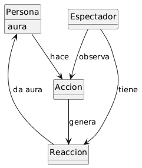

# Reto 001 - Modelo del Dominio: Farmear Aura

- **Escenario:** 2. Farmear aura
- **Diagrama en PlantUML:** [`../modelosUML/aura/modelo_dominio.puml`](../modelosUML/aura/modelo_dominio.puml)
- **Boceto original:** [`../images/aura/modelo_dominio.jpg`](../images/aura/modelo_dominio.jpg)

---

## 1. Diagrama del Modelo del Dominio

---

## 2. Brevísimo glosario

- **Farmear:** Adaptación del verbo inglés *to farm* (cultivar o cosechar en una granja), popularizado en los videojuegos para referirse a la realización reiterada de acciones con el propósito de recolectar y acumular puntos, experiencia o recursos. En este contexto, equivale a acumular *aura* mediante acciones.
- **Aura:** Concepto de raíz filosófica y espiritual que designa la sensación, presencia, carisma o irradiación intangible que emite un cuerpo o persona y que es percibida por los demás.
- **Persona:** Sujeto que ejecuta una acción y que posee como atributo propio el *aura*.
- **Acción:** Acto o comportamiento realizado por la persona, susceptible de ser observado y de provocar una respuesta.
- **Espectadores:** Individuos que presencian la acción ejecutada por la persona y experimentan una reacción ante ella.
- **Reacción:** Respuesta o impresión producida en el espectador al observar la acción, la cual otorga *aura* a la persona.

---

## 3. Supuestos adoptados

- Para que exista ganancia de aura es necesaria la presencia de al menos un espectador que observe la acción; sin observadores no se produce la reacción que otorga aura.
- El aura no es un objeto independiente, sino un atributo acumulable perteneciente a la `Persona`.
- La reacción es generada por la acción observada y pertenece al espectador que la experimenta.

---

## 4. Decisiones de modelado discutibles

- **El aura como atributo de `Persona` y no como entidad:** Aunque filosóficamente puede entenderse como una energía o campo que emana del cuerpo, se modela como un atributo de `Persona` porque no existe de forma autónoma sin el sujeto y funciona como una magnitud acumulable ("farmeable").
- **La `Reaccion` como fuente que "da aura":** Podría pensarse que la `Accion` por sí sola otorga aura a la persona; sin embargo, al ser el aura una sensación percibida desde el exterior, es la `Reaccion` generada en el `Espectador` la que valida y otorga dicho aura.
- **Distinción entre `Persona` y `Espectador`:** Se separan en dos entidades distintas según su rol dentro del escenario: quien actúa y acumula el atributo `aura` frente a quien observa y reacciona.
