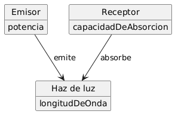

# Reto 001 - Modelo del Dominio: Una Sombra

- **Escenario:** 1. Una sombra
- **Modelo del Dominio (PlantUML):** [`../modelosUML/sombra/modelo_dominio.puml`](../modelosUML/sombra/modelo_dominio.puml)
- **Modelo de Estados (PlantUML):** [`../modelosUML/sombra/modelo_estados.puml`](../modelosUML/sombra/modelo_estados.puml)
- **Boceto original:** [`../images/sombra/image1.jpg`](../images/sombra/image1.jpg)

---

## 1. Diagramas

### 1.1. Modelo del Dominio

### 1.2. Modelo de Estados

---

## 2. Brevísimo glosario

- **Emisor:** Fuente generadora que emite el haz de luz con una potencia determinada.
- **Potencia:** Magnitud de emisión del emisor.
- **Haz de luz:** Radiación luminosa emitida y propagada, caracterizada por su longitud de onda.
- **Longitud de onda:** Distancia física periódica de la onda luminosa que determina su espectro.
- **Receptor:** Cuerpo o superficie que recibe e interactúa con el haz de luz según su capacidad de absorción.
- **Capacidad de absorción:** Propiedad del receptor para absorber el haz de luz; su ausencia se traduce en el reflejo de la luz.
- **Sombra:** Ausencia de luz, producida ya sea porque el haz de luz no es emitido o porque es absorbido por el receptor.

---

## 3. Supuestos adoptados

- El haz de luz se propaga en línea recta desde el emisor hasta el receptor.
- El reflejo de la luz es la ausencia de capacidad de absorción por parte del receptor.
- Se toma como sombra la ausencia de luz: es decir, cuando la luz no es emitida por el emisor o cuando es absorbida por el receptor.

---

## 4. Decisiones de modelado discutibles

- **La sombra como ausencia de luz y no como clase:** En este diseño se define la sombra como la mera ausencia de luz (porque no se emite o porque el `Receptor` la absorbe), por lo que no se modela como una entidad independiente con atributos propios, sino como un estado.
- **El reflejo como ausencia de capacidad de absorción:** No se incluye un atributo ni relación de reflexión por separado; basta con `capacidadDeAbsorcion` en el `Receptor`, entendiendo el reflejo de la luz como la carencia de dicha capacidad.
- **Precisión en `Haz de luz` y `longitudDeOnda`:** Se modela `Haz de luz` con `longitudDeOnda` en lugar de "Luz" y "longitud" a secas para eliminar ambigüedades entre la propiedad espectral de la onda y una distancia espacial.
