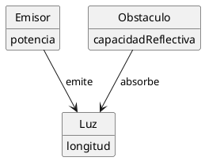

# Reto 001 - Modelo del Dominio: Una Sombra

- **Escenario:** 1. Una sombra
- **Diagrama en PlantUML:** [`../modelosUML/sombra/modelo_dominio.puml`](../modelosUML/sombra/modelo_dominio.puml)
- **Boceto original:** [`../images/sombra/image1.jpg`](../images/sombra/image1.jpg)

---

## 1. Diagrama del Modelo del Dominio

---

## 2. Brevísimo glosario

- **Emisor:** Fuente generadora de luz dotada de potencia.
- **Luz:** Radiación emitida caracterizada por su longitud de onda.
- **Obstáculo:** Elemento que intercepta la luz según su capacidad reflectiva.
- **Potencia:** Magnitud de emisión del emisor.
- **Longitud:** Longitud de onda de la luz emitida.
- **Capacidad reflectiva:** Capacidad del obstáculo para reflejar luz; lo que no refleja, lo absorbe.

---

## 3. Supuestos adoptados

- La luz se propaga en línea recta desde el emisor hacia el obstáculo.
- El obstáculo no transmite luz a través de él (es opaco).
- La sombra no es una entidad física independiente, sino el resultado directo de que el obstáculo absorba la luz emitida.

---

## 4. Decisiones de modelado discutibles

- **La sombra como efecto y no como clase:** No se modela la "Sombra" como una entidad con atributos propios, sino como la consecuencia de la absorción de luz por parte del obstáculo.
- **Absorber en lugar de bloquear:** Se asume que el obstáculo absorbe la luz incidente en función de su baja capacidad reflectiva (*"refleja poco, aparece sombra"*), impidiendo su paso.
